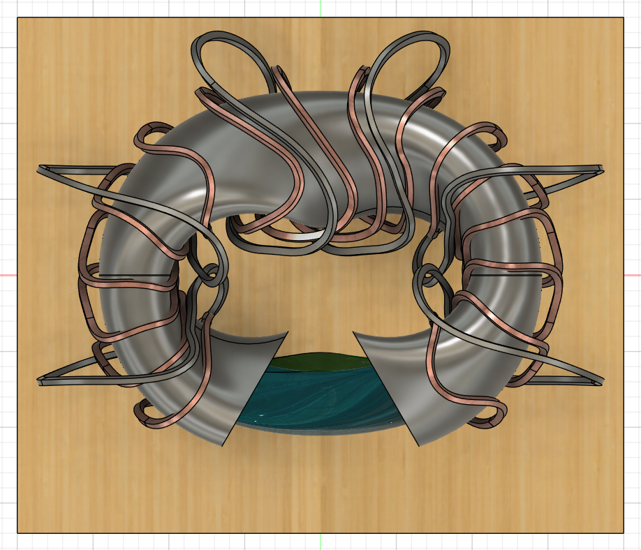
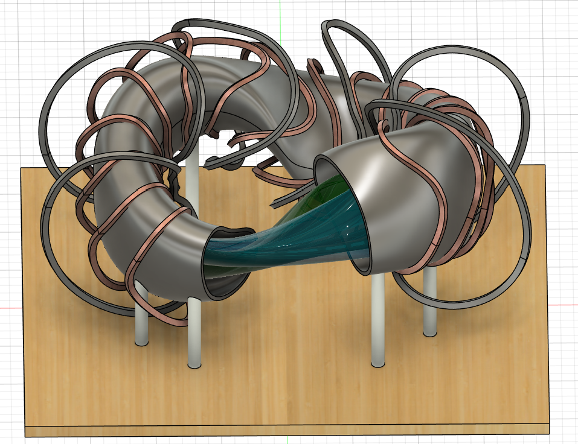
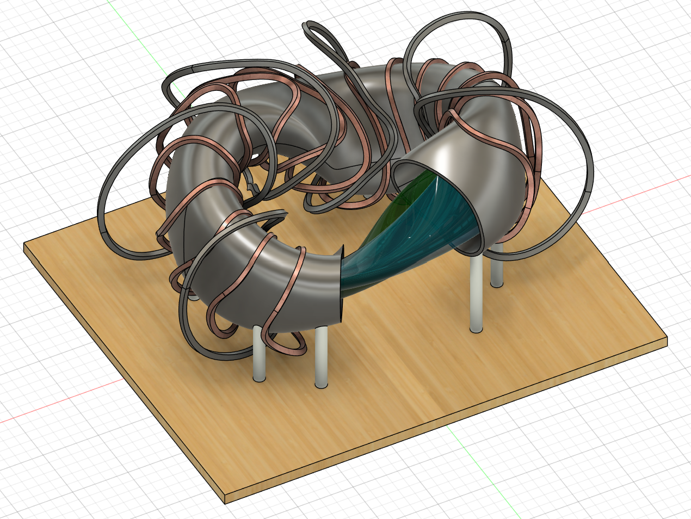
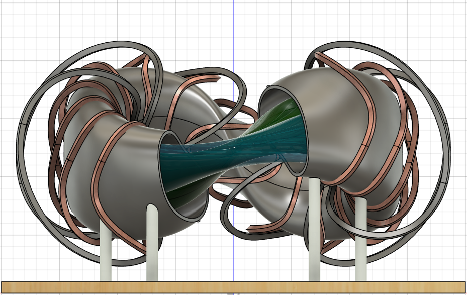
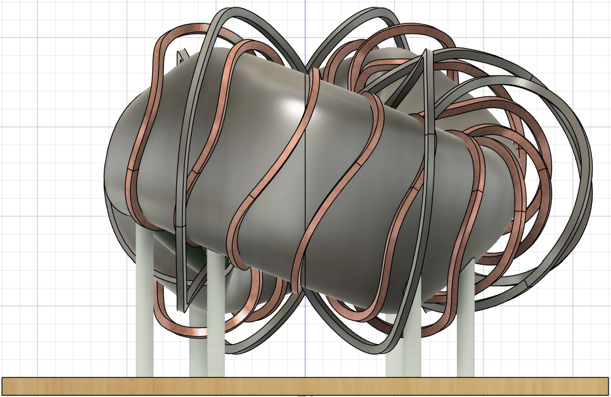
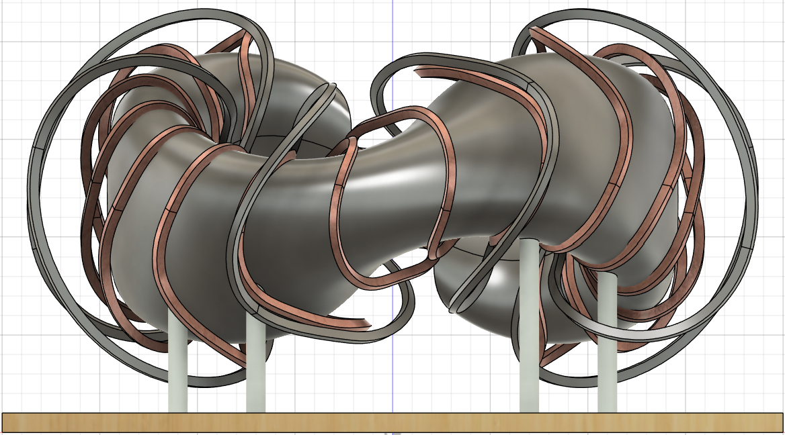

# Preliminary CAD Design of Table-Top Flexible Stellarator

This repository contains a preliminary CAD and 3D-printable design of a **table-top flexible stellarator**, developed to demonstrate the coexistence and switching of multiple quasi-symmetric states — specifically **piecewise-omnigenity (pwO)**, **quasi-isodynamic (QI)**, and **precise quasi-axisymmetry (QA)**.

The model serves as a physical visualization tool for understanding:
- 3D plasma boundary structures  
- Multi-state omnigenity and quasi-symmetry  
- Modular coil routing and geometric constraints  
- Rapid conceptual exploration using CAD + 3D printing workflows  

## 📐 CAD Views

Below are the exported CAD views of the stellarator prototype.

### Top & Upper–Front

  
  

### Upper–Left & Front

  
  

### Side & Back

  
  

---
